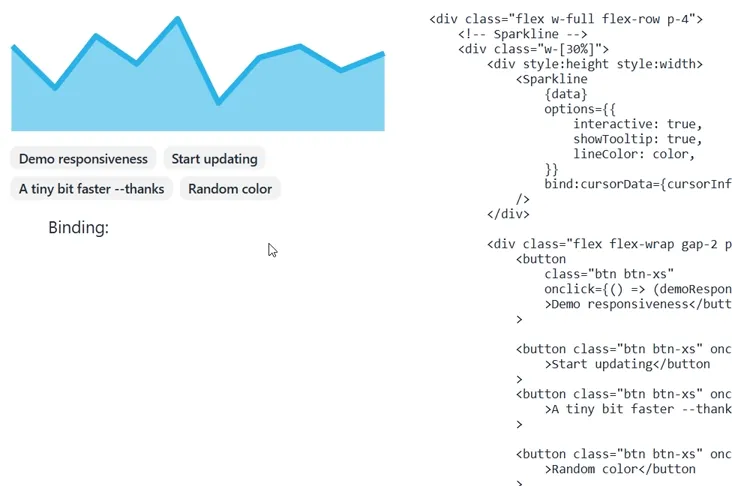

<!-- https://github.com/user-attachments/assets/22a4b3d6-2ca6-4a16-95b4-63f45d29dd51 -->



Demo: https://bn-l.github.io/sparkline-svelte/

# Sparkline

A lightweight and customizable Sparkline component for Svelte 5, based on [fnando/sparkline](https://github.com/fnando/sparkline) (used on npm to show a chart for weekly downloads), with various improvements and updates. Works on touch screens also.

This library creates a small responsive chart (apparently called "sparkline" for whatever reason)--without axis labels--for quick data visualization. It is ideal for displaying trends and patterns in data in a compact form--making it good for use in dashboards, reports, etc. The SVG output scales to fit its container for responsiveness on different screen sizes.

Changes to the data prop or any option will update the SVG reactively (with svelte 5 managing the SVG dom updates).

## Installation

Install the package via npm:

```bash
`npm install sparkline-svelte`
```

## Usage


### Basic Example

```svelte
<script>
    import Sparkline from "sparkline-svelte"; 
</script>

<Sparkline data={[5, 10, 15, 10, 5]} />
```

## Props

The `Sparkline` component accepts the following props (only the **`options.lineColor`** prop 
is needed to change all the colors automatically. The other options can be mostly ignored):

### `data` (required)

- **Type**: `number[] | { label: string; value: number }[]`
- **Description**: An array of numbers or objects containing `label` and `value` properties, representing the data points to plot. By supplying a `label`, you can provide any label for the values, and they will be displayed on the tooltip as `label: ${value}` when hovering over the sparkline.

### `options` (optional)

- **Type**: `Object`
- **Description**: An object to customize the appearance and behavior of the sparkline.

#### Options Properties:

- `lineColor`
    - **Type**: `string`
    - **Default**: `#FF476F`
    - **Description**: The color of the sparkline line. Setting this will automatically adjust related colors (`fillColor`, `cursorColor`, `tooltipFillColor`, `tooltipTextColor`) based on the provided `lineColor`.

- `fillColor`
    - **Type**: `string`
    - **Default**: A lighter shade based on `lineColor`
    - **Description**: The fill color under the sparkline.

- `cursorColor`    
    - **Type**: `string`
    - **Default**: A contrasting color based on `lineColor`
    - **Description**: The color of the cursor line when hovering over the sparkline.

- `strokeWidth`
    - **Type**: `number`
    - **Default**: `6`
    - **Description**: The width of the sparkline line.

- `spotRadius`
    - **Type**: `number`
    - **Default**: `2`
    - **Description**: The radius of the spots (data points) on the sparkline.

- `interactive`
    - **Type**: `boolean`
    - **Default**: `false`
    - **Description**: Enables cursor and tooltip on hover when set to `true`.

- `showTooltip`
    - **Type**: `boolean`
    - **Default**: `true`
    - **Description**: Shows tooltip with data point information on hover.

- `tooltipTextColor`
    
    - **Type**: `string`
    - **Default**: Based on `tooltipFillColor`
    - **Description**: The text color of the tooltip.

- `tooltipFillColor`
    - **Type**: `string`
    - **Default**: A contrasting color based on `fillColor`
    - **Description**: The background color of the tooltip.

- `tooltipFontSize`
    - **Type**: `string`
    - **Default**: `"0.875rem"`
    - **Description**: The font size of the tooltip text.

- `cursorWidth`
    - **Type**: `number`
    - **Default**: `2`
    - **Description**: The width of the cursor line.

- `svgClass`
    - **Type**: `string`
    - **Default**: `""`
    - **Description**: CSS class to apply to the SVG element.

- `toolTipClass`
    - **Type**: `string`
    - **Default**: `"tooltip-class"`
    - **Description**: CSS class to apply to the tooltip element.

### `cursorData` (optional, bindable)
- **Type**: `DataPoint | null`
- **Description**: A **bindable** prop that holds the current data point under the cursor when the sparkline is interactive. It can be used to access the data point's `x`, `y`, `value`, `index`, and `label` properties.

#### DataPoint:

```typescript
interface DataPoint {     
    x: number;     
    y: number;     
    value: number;     
    index: number;     
    label?: string; 
}
```

You can bind to `cursorData` to get the current data point under the cursor:

```svelte
<script>     
    import Sparkline from "sparkline-svelte";     
    let data = [5, 10, 15, 10, 5];     
    let cursorData = $state(null); 
</script>  

<Sparkline {data} options={{ interactive: true }} bind:cursorData />  

{#if cursorData}     
    <p>Current Value: {cursorData.value}</p>     
    <p>Index: {cursorData.index}</p>     
    <p>X: {cursorData.x}</p>     
    <p>Y: {cursorData.y}</p>     
    {#if cursorData.label}         
        <p>Label: {cursorData.label}</p>     
    {/if} 
{/if}
```

## Examples

```svelte
<script>     
    import Sparkline from "sparkline-svelte";      
    let data = [         
        { label: "Jan", value: 10 },         
        { label: "Feb", value: 15 },         
        { label: "Mar", value: 12 },         
        { label: "Apr", value: 20 },         
        { label: "May", value: 18 }     
        ]; 
</script>  

<Sparkline {data} options={{ lineColor: "#27ae60", interactive: true }} />
```

In this example, by supplying a `label` for each data point, the tooltip will display the label and value as `label: ${value}` when hovering over the sparkline.

#### Reactive Data Updates

```svelte
<script>     
    import Sparkline from "sparkline-svelte";      
    let data = $state([]);      
    // Simulate data updates     
    let interval;      
    $effect(() => {         
        interval = setInterval(() => {             
            let value = Math.floor(Math.random() * 100);             
            data.push(value);             

            // Keep only the last 10 data points             
            if (data.length > 10) {                 
                data.shift();             
            }         
        }, 1000);          
  
        return () => clearInterval(interval);     
    }); 
</script>  

<Sparkline {data} options={{ lineColor: "#e74c3c", interactive: true }} />
```

The graph will reactively update as the data prop is updated.

## License

[MIT](LICENSE)
